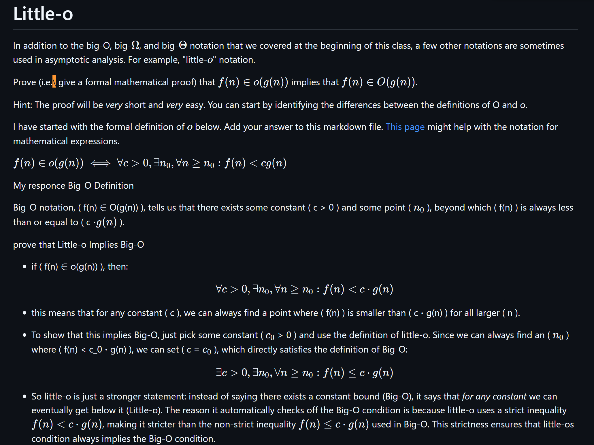

# Little-o

In addition to the big-O, big-$\Omega$, and big-$\Theta$ notation that
we covered at the beginning of this class, a few other notations are sometimes
used in asymptotic analysis.  For example, "little-$o$" notation.

Prove (i.e.\ give a formal mathematical proof) that $f(n)\in o(g(n))$ implies
that $f(n)\in O(g(n))$.

Hint: The proof will be *very* short and *very* easy. You can start by
identifying the differences between the definitions of O and o.

I have started with the formal definition of $o$ below. Add your answer to this
markdown file. [This
page](https://docs.github.com/en/get-started/writing-on-github/working-with-advanced-formatting/writing-mathematical-expressions)
might help with the notation for mathematical expressions.

$f(n)\in o(g(n)) \iff \forall c>0, \exists n_0, \forall n\ge n_0: f(n) < c g(n)$

My responce Big-O Definition 

Big-O notation, ( f(n) $\in$ O(g(n)) ), tells us that there exists some constant ( c > 0 ) and some point ( $n_0$ ), beyond which ( f(n) ) is always less than or equal to ( c $\cdot g(n)$ ).  

prove that Little-o Implies Big-O

- if ( f(n) $\in$ o(g(n)) ), then:  
  $$ \forall c > 0, \exists n_0, \forall n \geq n_0: f(n) < c \cdot g(n) $$  

- this means that for any constant ( c ), we can always find a point where ( f(n) ) is smaller than ( c $\cdot$ g(n) ) for all larger ( n ).  

- To show that this implies Big-O, just pick some constant ( $c_0$ > 0 ) and use the definition of little-o. Since we can always find an ( $n_0$ ) where ( f(n) < c_0 $\cdot$ g(n) ), we can set ( c = $c_0$ ), which directly satisfies the definition of Big-O:  
  $$ \exists c > 0, \exists n_0, \forall n \geq n_0: f(n) \leq c \cdot g(n) $$  

- So little-o is just a stronger statement: instead of saying there exists a constant bound (Big-O), it says that _for any constant_ we can eventually get below it (Little-o).
The reason it automatically checks off the Big-O condition is because little-o uses a strict inequality $ f(n) < c \cdot g(n) $, making it stricter than the non-strict inequality $ f(n) \leq c \cdot g(n) $ used in Big-O. This strictness ensures that little-os condition always implies the Big-O condition.

I did use the first 29 of these videos to try and help me understand this, i plan to watch the rest in the future:
https://youtube.com/playlist?list=PLBlnK6fEyqRhoF3cPp0mgOZPuXeu84nAd&si=5Ayirbef-U58D_wL

also i dont like KaTeX (sadface)

Also this is what it was supposed to look like i dont quite understand why it didnt show up in github the same way it shows up in my previewer... i literally downloaded the "github previewer"

I certify that I have listed all sources used to complete this exercise, including the use of any Large Language Models. All of the work is my own, except where stated otherwise. I am aware that plagiarism carries severe penalties and that if plagiarism is suspected, charges may be filed against me without prior notice.